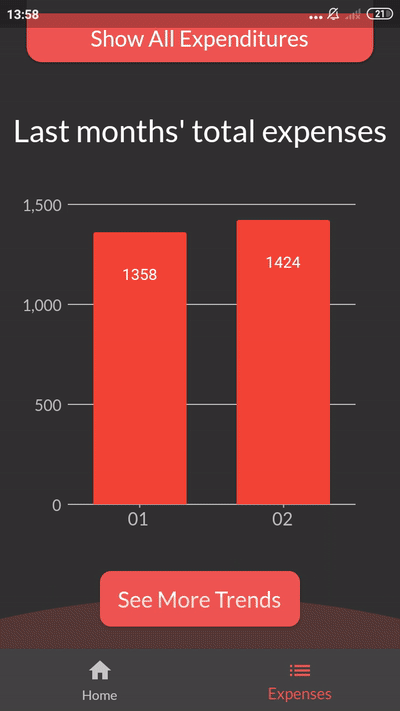
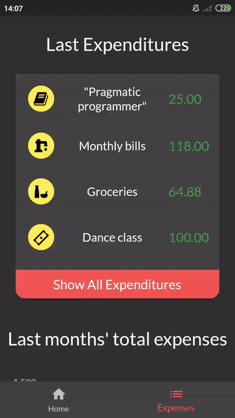
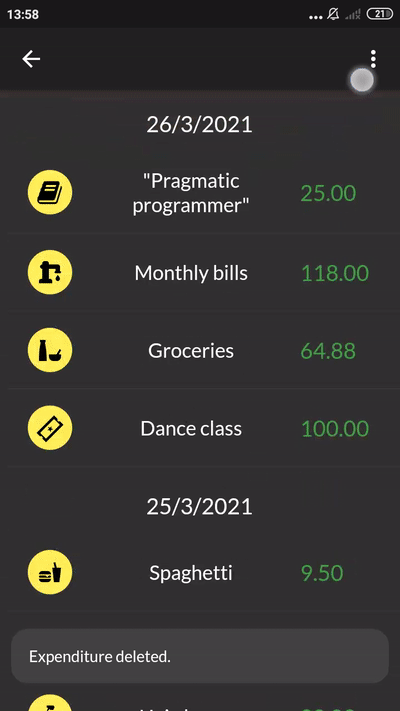

# Expenses-app

## Introduction

App for tracking personal expenses. It allows you to add expenses, categorize them, filter them, and display trends of your spending (grouped by months or by category). Written in Flutter, based on Stacked architecture (MVVM) and GetIt.

## Features

- Adding expenditures to various categories (and deleting them)
- Adding your own categories
- Filtering expenditures by price, date and categories
- Displaying spending trends from chosen time period (grouped by months or by category)
- Quick preview of current month's spending, last expenditures and last months trends

## Launch

If you want to launch the app, you can download expenses_app.apk file from apk folder and install it on your device.

## App Preview

 
 
